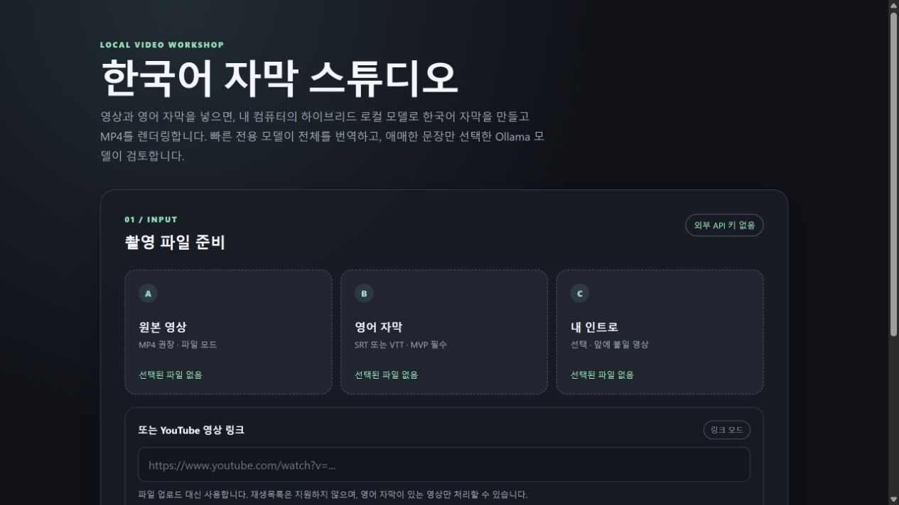

<!-- JUWON-PORTFOLIO-INTRO:START -->
# YT Korean Studio



*Recorded subtitle-studio UI preview; translation models and backend not connected; video processing not exercised.*

*기존 자막 스튜디오 UI · 번역 모델·백엔드 미연결 · 영상 작업 미실행*

## English

A Windows-local video subtitle studio accepting MP4 files or supported YouTube URLs, translating English subtitle cues locally, and rendering Korean captions with FFmpeg. Model availability, source subtitles, and reuse rights remain prerequisites.

[View JUWON's portfolio](https://jupt.pages.dev/) · [Browse the project collection](https://jupt.pages.dev/projects)

**Scope:** This README presents the repository's documented intent and recorded visual evidence. It does not certify that every feature is complete, deployed, or currently working. Follow the original setup, safety, and license documentation below.

This repository is a selected original-source snapshot. The recorded source fingerprint describes the initial publication; this portfolio introduction was added afterward. Original technical documentation is preserved below.

## 한국어

영상 입력·유튜브 다운로드·한국어 자막·최종 출력·QA를 다루는 웹앱.

[JUWON 포트폴리오 보기](https://jupt.pages.dev/) · [전체 프로젝트 보기](https://jupt.pages.dev/projects)

**확인 범위:** 저장소의 문서상 목적과 기록된 화면 근거를 소개합니다. 모든 기능의 완성·배포·현재 정상 작동을 보증하지 않습니다. 설치법·안전 주의사항·라이선스는 아래 기존 문서를 확인하세요.

선택된 원본 소스의 공개 스냅샷입니다. 기록된 소스 지문은 최초 공개 시점을 나타내며, 이 포트폴리오 소개는 이후 추가했습니다. 기존 기술 문서는 아래에 보존했습니다.
<!-- JUWON-PORTFOLIO-INTRO:END -->

---

## Original documentation / 기존 문서

# YT-Korean-Studio

Windows-local video subtitle studio. Select a source MP4 or a single HTTPS YouTube video URL, provide English subtitles when using a local file, and optionally add an intro. The default hybrid path translates with a local CPU-optimized model, then sends only suspicious cues to a locally installed Ollama model for review. FFmpeg burns Korean subtitles and the app produces a final MP4. No paid runtime API is required.

The existing `localhost:3000` Second Brain project is separate and is not modified. This app uses `http://127.0.0.1:8000`.

## Safety and rights

- No OpenAI, Google, DeepL, Claude, Gemini, or other metered API calls.
- Default mode: `hybrid`. A missing fast model automatically falls back to Ollama, so the app still works before optional setup (slower).
- Review model: `qwen3.5:4b` through local Ollama. Models are never downloaded automatically.
- Source media is copied into a job folder and never overwritten.
- Use only local or rights-cleared media. Translation or subtitles do not grant reuse rights.
- There is no automatic upload or publishing action. Review facts, captions, and rights yourself.
- YouTube link mode requires the checkbox confirming that you have the right to use the video. The app accepts only HTTPS video URLs, disables playlists, and requires English subtitles; it does not transcribe audio.
- YouTube link mode uses the Python `yt-dlp` package installed in this project's virtual environment. Its fixed downloader settings request one video and English manual/automatic subtitle sidecars; no user cookies or arbitrary downloader configuration is loaded. See the [official yt-dlp documentation](https://github.com/yt-dlp/yt-dlp) for the supported subtitle and no-playlist options.

## Windows quick start

From PowerShell in this project folder:

```powershell
.\scripts\setup_windows.ps1
ollama list
.\.venv\Scripts\python.exe scripts\check_dependencies.py
.\.venv\Scripts\python.exe -m uvicorn backend.app.main:app --host 127.0.0.1 --port 8000
```

Open `http://127.0.0.1:8000`. Choose either local files or paste one YouTube link, confirm rights for a link, then press **Create Video**. Leave the terminal running while a job renders. Stop it with `Ctrl+C`.

To keep the server running in a hidden background process, use:

```powershell
.\scripts\start_server.ps1
```

It reuses an already listening instance and writes startup logs to `data/server/`.

`setup_windows.ps1` creates only this project's `.venv` and installs the project there. Use `-SkipInstall` if dependencies were already installed:

```powershell
.\scripts\setup_windows.ps1 -SkipInstall
```

The read-only dependency report checks Python, FFmpeg, Ollama reachability, and locally installed model names. It never installs, pulls, or changes system software.

### Faster hybrid translation (optional)

Install the CPU INT8 OPUS-MT path explicitly; the app never downloads models at startup:

```powershell
.\scripts\install_fast_model.ps1
```

The script installs the `.[fast]` extras (including the one-time PyTorch conversion dependency) in this project's virtual environment, downloads `Helsinki-NLP/opus-mt-tc-big-en-ko` into `data/models/`, preserves its separate English/Korean vocabularies, and converts it to a CTranslate2 INT8 model. Runtime translation uses CTranslate2 on CPU. Restart the local server after setup. The model card is [CC-BY-4.0](https://huggingface.co/Helsinki-NLP/opus-mt-tc-big-en-ko); keep its attribution if you redistribute the model or a product containing it.

Hybrid behavior is designed to be repeatable for the same inputs: the fast model handles ordinary cues, while empty/unchanged/garbled, long, acronym-heavy, or number-containing cues are reviewed (up to 24 cues per batch) by the selected Ollama model at temperature 0. If the review pass fails, the fast translation is retained. If the fast model is unavailable, the first failure switches the current job to Ollama-only without repeatedly probing the missing model.

Formatting removes overlapping auto-caption windows before writing SRT/ASS, so two cues cannot render on top of each other. It also writes `subtitles/qa.json` and checks the structural rules from the [PyCon.KR subtitle guide](https://github.com/pythonkr/pyconkr-guide/tree/master/subtitles): 1–7 second cue duration, at most two lines, at most 21 characters per line, and short-gap merge recommendations. It reports warnings without blocking video rendering; linguistic boundaries and speech-onset timing still need human review.

Use Ollama-only mode when needed:

```powershell
$env:YTKS_TRANSLATION_MODE = "ollama"
```

Fast model paths can be changed with `YTKS_FAST_MODEL_DIR` and `YTKS_FAST_TOKENIZER_DIR`.

## Development and tests

```powershell
py -3.11 -m venv .venv
.\.venv\Scripts\python.exe -m pip install -e ".[dev]"
.\.venv\Scripts\python.exe -m pytest -q
```

The resumable pipeline stores each job under `data/jobs/{job_id}`:

```text
source/          original video and optional intro
subtitles/       original, Korean SRT, Korean ASS
                 qa.json (PyCon.KR structural checks)
output/          subtitled.mp4 and final.mp4
transcript.json  original text beside Korean translation
metadata.json    model and input metadata
logs/job.log     stage history and errors
```

If rendering fails, run the same job again through the API or UI. Existing parsed, translated, and formatted outputs are reused when input fingerprints still match. Ollama errors become a failed job with a readable message instead of an indefinite hang.

### API input modes

`POST /api/jobs` accepts exactly one of these source modes:

- Multipart `video` file, with an optional English `subtitle` file and optional `intro` video.
- Form field `youtube_url` containing one HTTPS YouTube video URL and `rights_confirmed=true`. The downloader saves the video and English subtitle into the job's normal source folder before the same translation and FFmpeg stages run.

The service never uploads or publishes the resulting video. Keep the local server running while the browser page is open; `scripts/start_server.ps1` starts it as a hidden process and reuses an already listening instance.

## Optional model benchmark

The benchmark harness never pulls models. Call it with the same sample and installed model names after Ollama is running:

```powershell
.\.venv\Scripts\python.exe -c "import json; from pathlib import Path; from backend.app.benchmark import run_benchmark; from backend.app.config import load_settings; from backend.app.providers.translation.ollama import OllamaTranslationProvider, list_local_models; from backend.app.subtitles.types import SubtitleSegment; s=[SubtitleSegment(**x) for x in json.loads(Path('tests/fixtures/benchmark_segments.json').read_text(encoding='utf-8'))]; c=load_settings(); run_benchmark(s, list_local_models(c.ollama_base_url), provider_factory=lambda m: OllamaTranslationProvider(c.ollama_base_url,m), output_dir=c.data_dir/'benchmarks')"
```

Results are written to `data/benchmarks/` for side-by-side timing and translation review.
